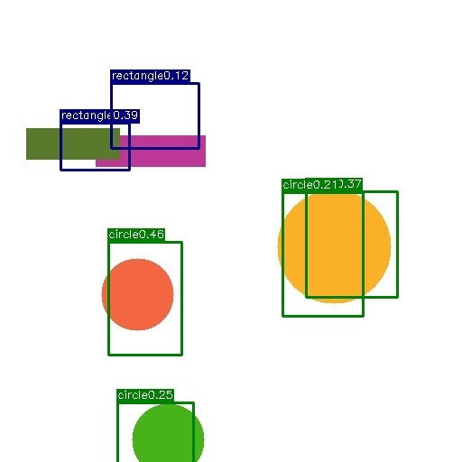

# 基于vgg16网络的yolov1实现

​	预训练模型：vgg16_bn-6c64b313.pth

​	pytorch ==1.2.0

​	数据集下载：链接：https://pan.baidu.com/s/11GvovzqVydZxAYySmAeyxA  提取码：qj46

​	我的数据集只有两类，circle 和 rectangle ，1000张图片训练50轮的效果如下

​	（还没有认真调试，效果很差）

​	